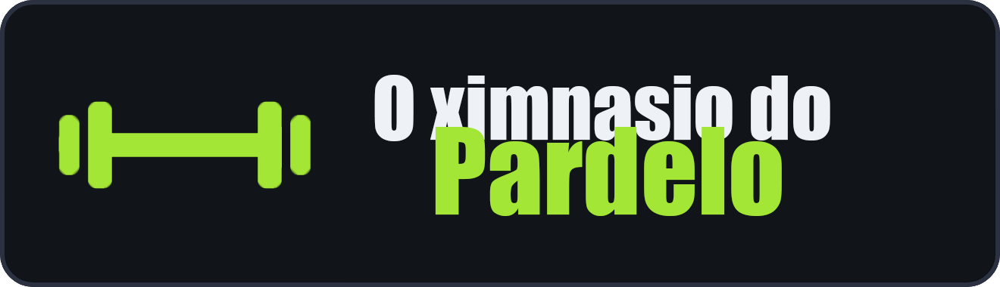
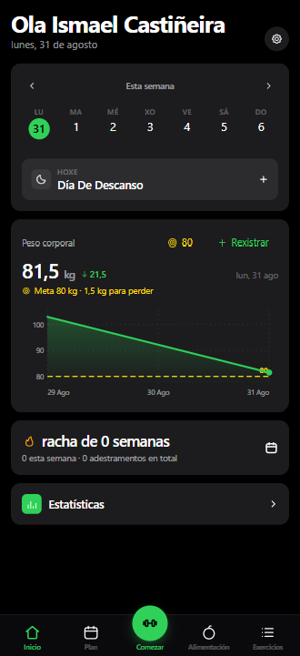
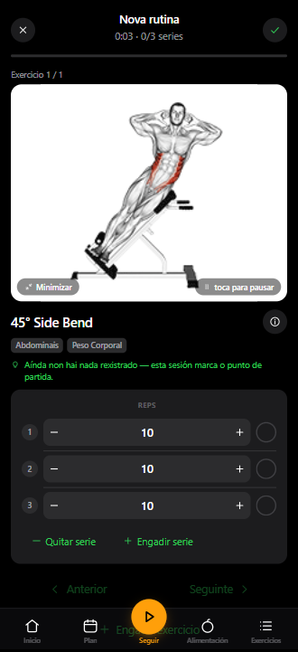
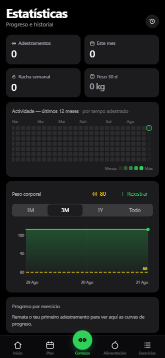

<div align="center">



<br>

**Controla o que comes, o exercicio que fas e a tua saúde sen depender de nadie**

Planifica a túa semana, realiza adestramentos guiados, rexistra cada serie e o teu peso
corporal ao longo do tempo — no teu móbil, sincronizado entre dispositivos, detrás do teu
propio inicio de sesión con Google ou usuario/contrasinal. Sen conta nun servidor alleo,
sen subscrición, sen anuncios.

<br>


</div>

<br>

<div align="center">
<table>
<tr>
<td align="center"><br><sub><b>Inicio</b> — adestramento e peso de hoxe</sub></td>
<td align="center"><br><sub><b>Adestramento guiado</b> — demostracións animadas e series</sub></td>
<td align="center"><br><sub><b>Estatísticas</b> — mapa de calor, gráficas e récords persoais</sub></td>
</tr>
</table>
</div>

## Por que

A maioría das apps de adestramento bloquean os teus datos detrás dun inicio de sesión nos seus
servidores, insisten en que actualices a un plan de pago, ou desaparecen cando a startup pecha.
'O Ximnasio do Pardelo' é o contrario: **funciona na túa propia máquina, os teus datos quedan nunha base de
datos que ti controlas, e é teu para modificalo (fork).** Aínda así resulta moderno — instalable
como app de pantalla de inicio, inicio de sesión con Google ou usuario, funcionamento sen
conexión, sincronización entre o teu móbil e o portátil.

## Funcionalidades

- ⚖️ **Rexistro do peso corporal** — gráfica interactiva cunha liña de obxectivo que ti defines, gañancias/perdas coloreadas segundo se achegan ou non a ese obxectivo
- 🏋️ **Plan semanal** — unha rutina por cada día da semana, sobre unha biblioteca de **1.324 exercicios** (con busca, con demostracións animadas)
- 🗓️ **Reprograma calquera día** — ¿enfermaches, faltaches a unha sesión, ou tes menos días de ximnasio esta semana? Move un adestramento a outro día sen tocar o teu plan semanal
- ▶️ **Adestramentos guiados** — sabe que día é e inicia a sesión de hoxe; pregunta primeiro o teu peso corporal, precarga os teus pesos da última vez, temporizador de descanso, detección de récords persoais, seguimento de peso por exercicio
- ☀️ **A pantalla mantense acesa mentres adestras** — sen ter que desbloquear o móbil e volver atopar o teu punto entre cada serie. Activa mentres dura o adestramento, libérase no momento en que remata, e pódese desactivar en Axustes
- 🔗 **Superseries** — créaas, e rexístraas unha detrás doutra cun descanso só despois da parella
- ⏱️ **Exercicios cronometrados** — planchas, colgamentos, sentadillas na parede e portes con carga rexístranse por tempo, non por repeticións, cun temporizador de traballo que conta a propia serie (separado do temporizador de descanso) e rexistra o tempo que realmente aguantaches. Tamén poden levar peso
- 📈 **Progresión que segue unha regra** — escolle unha por rutina, ou anúlaa por exercicio: lineal, **Greyskull LP** (serie top AMRAP, saltos dobres, reinicios do 10 %), progresión dobre nun rango de repeticións, ou engadindo tempo. Os teus pesos xa están correctos cando abres a sesión, e cada obxectivo indica *por que* é ese número. As repeticións falladas nunca avanzan a carga, os estancamentos provocan unha descarga (deload), e os exercicios de peso corporal progresan en repeticións no seu lugar
- 💪 **1RM estimado** — por exercicio, a partir da túa mellor serie válida (indica cal é), coa súa propia curva de progreso e unha calculadora para series que aínda non fixeches. Non estima por riba de 12 repeticións
- 🎯 **Esforzo por serie, na túa escala** — unha terceira columna opcional que valora o dura que foi unha serie, como **RIR** (repeticións que quedaban) ou **RPE** (o mesmo xuízo nunha escala de 10 puntos). Desactivado por defecto; cada serie conserva a escala coa que se rexistrou, e ningunha outra parte da app le ese valor — a túa progresión e o 1RM non se ven afectados
- 💪 **Exercicios de peso corporal, rexistrados como tal** — flexións, dominadas, fondos e outros 300 e pico xa saben que non levan carga, así que non hai columna de peso nin aviso de peso de traballo: un só selector, rexistra as repeticións. Engade un cinto de lastre e conta como unha adición, e a progresión volve a seguir o peso. Sen el, as repeticións van subindo — e superado un teito que ti marcas, engádese unha serie en vez dunha repetición, ata o punto en que o máis honesto é engadir carga ou unha variante máis difícil
- ↔️ **Repeticións por lado** — para zancadas, remo a un brazo e demais. Rexistras o total, a app amosa o reparto ("8 por lado"), e o obxectivo avanza de dous en dous para que nunca caia nun número que un dos lados non poida ter
- 🏃 **Cardio** — rexistra tempo + velocidade, non só peso × repeticións
- 🥗 **Alimentación** — rexistra o que comes por Almorzo/Xantar/Cea/Snacks, cunha busca instantánea sobre a túa propia biblioteca de alimentos e receitas creadas por ti; escanea o código de barras dun produto coa cámara do móbil para atopalo ao instante. Cada rexistro garda a súa propia cantidade e unidade (gramos, onzas, cuncas...), cos macros recalculados en tempo real. Un panel diario amosa as calorías restantes fronte ao teu obxectivo (consumidas menos queimadas por exercicio, que rexistras á man) e o progreso de proteína, hidratos e graxas en barras — todo sincronizado coma o resto dos teus datos, sen depender de ningunha API externa
- 📤 **Comparte un plan** — envía a alguén as túas rutinas e o horario semanal nun ficheiro pequeno (sen adestramentos nin pesaxes), ou imprímeo como un PDF limpo. Importar fai unha fusión, así que o plan de quen o recibe nunca se sobrescribe
- 🔧 **Filtra por equipamento** — reduce a biblioteca ao que realmente tes; as opcións adáptanse ao que xa escolliches, así que toda combinación en pantalla ten resultados detrás
- ✨ **Os teus propios exercicios** — abonda cun nome e unha parte do corpo; compórtanse igual que os incorporados en todas partes, cunha descrición opcional no canto dunha animación
- 🟩 **Mapa de calor de actividade** — unha vista anual ao estilo GitHub, sombreada polo tempo adicado a adestrar
- 💪 **Mapa muscular** — un diagrama do corpo de fronte e de costas, sombreado segundo o traballo que recibiu cada músculo, nunha semana, un mes ou todo o historial. Indica os músculos que *non* traballaches nese período, mostra unha vista previa do que traballa unha rutina mentres a creas, e amosa o que acabas de traballar ao rematar. Figura masculina ou feminina, ao teu gusto
- 🔔 **Notificacións push** — avisos do temporizador de descanso aínda coa app pechada, ademais dun recordatorio opcional os días nos que tes un adestramento planificado pero aínda non o rexistraches. Actívase por perfil; as claves xéranse na primeira execución, nada que configurar
- 🔑 **Inicio de sesión con Google ou usuario/contrasinal** — cada perfil garda os seus propios datos, sincronizados entre dispositivos; as contas novas necesitan un código de invitación que ti defines e podes rotar en calquera momento
- 🛠️ **Panel de administración** — para quen xestione a instancia: quen está adestrando agora mesmo, historial por usuario, deshabilitar contas, e o código de invitación actual.
- 📦 **Teu para conservar** — exportación/importación JSON dun toque, modo convidado, **sen telemetría**
- 📱 **App de Android independente** — todo o rastrexador como un APK instalable manualmente: sen conta, sen servidor, datos no móbil, recordatorios nativos de adestramento (compílao ti mesmo — **[docs/MOBILE.md](docs/MOBILE.md)**)

## Configuración

### Requisitos

Para o despregamento completo (o recomendado), no servidor:

| Requisito | Detalle |
|---|---|
| **PHP 8.0+** | Sen Composer, sen extensións raras, sen procesos en segundo plano |
| **MariaDB / MySQL** | Unha base de datos calquera; as táboas levan prefixo `ximnasio_pardelo_`, así que pode compartirse cun WordPress existente |
| **phpMyAdmin** (ou equivalente) | Só para importar `api/schema.sql` unha vez e editar a configuración despois |
| **HTTPS** | Practicamente todos os aloxamentos o emiten gratis; é o que fai a app instalable como PWA |

**Non** precisa: Docker · Node.js no servidor · acceso por shell · cron do sistema · CDN propio.

Nun computador calquera (unha soa vez, para compilar o frontend): **Node.js 20+**. Se non o
tes nin o queres instalar, vale calquera sandbox no navegador tipo StackBlitz ou un Codespace.

```bash
cd frontend
npm ci
npm run build        # xera frontend/dist/ — o que subes ao aloxamento
npm test             # probas da lóxica de adestramento (Vitest)
```

### 🌐 Hosting PHP compartido

Esta é a forma recomendada de autoaloxar O Ximnasio do Pardelo: un backend completo que só
precisa PHP e unha base de datos MariaDB — a mesma combinación que xa inclúe a maioría dos
hostings de WordPress. Inicio de sesión con Google ou conta de usuario/contrasinal,
sincronización por perfil, panel de administración e notificacións push, todo funcionando nun
hosting compartido normal, sen Docker, sen Node, sen acceso por shell. A configuración (URL do
sitio, código de invitación, lista de administradores...) vive nunha única táboa da base de
datos que editas por phpMyAdmin, non un ficheiro que teñas que volver subir. Guía completa,
incluíndo un percorrido por Google Cloud Console:
**[docs/DATABASE_BACKEND.md](docs/DATABASE_BACKEND.md)**.

### 📄 Aloxamento estático

Se só tes un espazo de ficheiros estáticos (sen PHP nin base de datos), a app funciona igual en
modo local: todos os datos quedan no navegador, sen contas nin sincronización.
Guía: **[docs/STATIC_HOSTING.md](docs/STATIC_HOSTING.md)**.

### 📱 App móbil

O mesmo código tamén compila unha **app móbil independente** (Capacitor): sen conta, sen
sincronización, sen backend — todo queda no móbil, con recordatorios nativos os días de
adestramento e copias de seguridade a través do menú de compartir. O autoaloxamento dáche
sincronización entre varios dispositivos e perfís para amigos e familia; a app móbil é a
opción de instalar e listo.

- **Android:** compílao ti mesmo como un APK e instálao manualmente — O Ximnasio do Pardelo non
  está na Play Store a propósito. Guía: **[docs/MOBILE.md](docs/MOBILE.md)**.
- **iPhone:** Apple non permite instalar apps fóra da App Store, así que non hai descarga para
  iOS. Autoalóxaa e engádea á túa pantalla de inicio desde Safari (é unha PWA completa), ou
  compila a app nativa no teu propio dispositivo desde Xcode — consulta
  **[docs/MOBILE.md](docs/MOBILE.md)**.

## Estrutura xeral

```
oXimnasioDoPardelo/
├── api/                        # Backend PHP — cada ficheiro un endpoint JSON
│   ├── _bootstrap.php          # Arranque común (config, cabeceiras, sesión)
│   ├── config.example.php      # Modelo de config.php (credenciais e segredos)
│   ├── schema.sql              # Todas as táboas ximnasio_pardelo_*
│   ├── login.php · register.php · auth-google.php · me.php · logout.php
│   ├── data.php                # Lectura/escritura do estado sincronizado
│   ├── push-*.php · cron.php   # Notificacións e tarefas programadas
│   ├── admin/                  # Endpoints do panel de administración
│   ├── lib/                    # db · session · push · util
│   └── tests/                  # Autoproba das notificacións push
│
├── frontend/                   # App React + Vite
│   ├── src/
│   │   ├── views/              # Pantallas: Home, Workout, Plan, Stats, Nutrition,
│   │   │                       #   Library, History, Settings, Login, Admin…
│   │   ├── components/         # UI reutilizable: BodyMap, Heatmap, LineChart,
│   │   │                       #   RestTimer, BarcodeScanner, TabBar…
│   │   ├── lib/                # Lóxica pura + probas: progression, onerm, effort,
│   │   │                       #   history, nutrition, import-csv, plan-share, i18n…
│   │   ├── store/              # Estado global (Zustand): useStore, useUI
│   │   ├── locales/            # Traducións da interface (gl, es)
│   │   ├── instr/              # Instrucións de exercicios por idioma
│   │   ├── sheets.jsx          # Follas modais de adestramento
│   │   └── nutrition-sheets.jsx
│   ├── public/                 # manifest.json, service worker, iconas
│   ├── dist/                   # Compilación lista para subir (xerada)
│   ├── android/ · ios/         # Proxectos nativos de Capacitor
│   └── vite.config.js
│
├── assets/                     # Banner e capturas de pantalla
└── docs/
    ├── DATABASE_BACKEND.md     # Despregamento completo PHP + MariaDB
    ├── STATIC_HOSTING.md       # Aloxamento só de ficheiros estáticos
    └── MOBILE.md               # Compilar a app de Android / iOS
```

A lóxica de adestramento — regras de progresión, estimación do 1RM, como se le de volta unha
sesión rexistrada — vive en funcións puras baixo `frontend/src/lib/`, con probas ao seu carón
(`npm test`). A app en si non ten máis dependencias en tempo de execución que React, o router e
Zustand.

## Evolución por versión

### v1.1.0
- Módulo de **alimentación**: rexistro por comidas, biblioteca propia de alimentos e receitas, escáner de códigos de barras, panel diario de calorías e macros.

### v1.0.0

- Base do rastrexador de adestramento: **plan semanal** cunha rutina por día, sobre unha biblioteca de 1.324 exercicios con busca, demostracións animadas e filtro por equipamento.
- **Adestramentos guiados**: sesión do día, precarga dos pesos anteriores, temporizador de descanso, detección de récords persoais e reprogramación de calquera día sen tocar o plan.
- Tipos de serie completos: superseries, exercicios cronometrados (con temporizador de traballo propio), peso corporal (con lastre opcional), repeticións por lado e cardio (tempo + velocidade).
- **Progresión automática por regra** — lineal, Greyskull LP, progresión dobre e por tempo — con estancamentos, descargas (deloads) e anulación por exercicio.
- **1RM estimado** por exercicio, con curva de progreso e calculadora; **esforzo por serie** opcional en escala RIR ou RPE.
- **Rexistro do peso corporal** con gráfica interactiva e liña de obxectivo.
- **Estatísticas**: mapa de calor anual de actividade, mapa muscular (fronte/costas) por semana, mes ou historial, e gráficas de progreso.
- Exercicios propios creados polo usuario, importadores desde FitNotes / Strong / Hevy e peso corporal desde Apple Health.
- **Compartir plans** nun ficheiro lixeiro ou en PDF, con importación por fusión; exportación/importación JSON completa e modo convidado.
- **Inicio de sesión** con Google ou usuario/contrasinal, perfís independentes sincronizados entre dispositivos e código de invitación rotable.
- **Panel de administración**: quen adestra agora, historial por usuario, desactivar contas e xestión do código de invitación.
- **Notificacións push** de descanso e recordatorio de adestramento pendente, activables por perfil.
- Autoaloxamento en hosting PHP + MariaDB compartido (sen Docker, sen Node no servidor, sen shell), con configuración na base de datos.
- **App móbil independente** (Capacitor) para Android/iOS: sen conta nin servidor, datos locais, recordatorios nativos e copias de seguridade polo menú de compartir.
- Sen telemetría. Lóxica de adestramento en funcións puras con probas (Vitest).

## Folla de ruta

- [x] Programas de progresión automática (lineal, Greyskull LP, progresión dobre) con estancamentos e descargas (deloads)
- [x] 1RM estimado por exercicio
- [ ] Programación por porcentaxes / training-max (estilo 5/3/1) sobre o motor de progresión
- [ ] Máis plans iniciais (torso/perna, corpo completo, 5×5)
- [x] Importadores desde FitNotes / Strong / Hevy (incluíndo o RPE que rexistran), e peso corporal desde Apple Health
- [x] Esforzo por serie — RIR ou RPE, a escala coa que penses
- [ ] Medidas corporais (cintura, brazos…) xunto ao peso
- [x] Control de alimentación
- [ ] Instrucións de exercicios en galego (o conxunto de datos orixe aínda non as inclúe; amósanse en inglés mentres tanto)

## Autor

[Ismael Castiñeira](https://ipardelo.es)

```bash
VIVA GHALISIA E A COSTA DA MORTE! 💀
```
